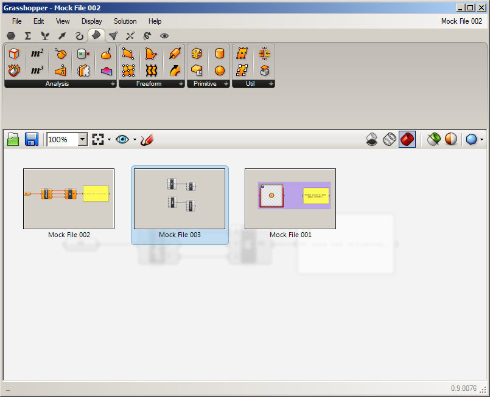

### 1.1.2. THE GRASSHOPPER UI

#####Grasshopper’s visual “plug-and-play” style gives designers the ability to combine creative problem solving with novel rule systems through the use of a fluid graphical interface.

Let’s start by exploring Grasshopper’s user interface. Grasshopper is a visual
programming application where you are able to create programs, called
definitions or documents, by dragging components onto the main portion of the
window (called the canvas). The outputs to these components are connected to
the inputs of subsequent components — creating a graph of information which
can be read from left to right. Reading this section will orient you to all of
the basics of the user interface to this extremely powerful and useful tool.

If you’ve already downloaded, installed and launched the Grasshopper plug-in
for Rhino3D (as explained in 1.1.1), observe that the Grasshopper interface has
a number of elements, most of which will be very familiar to Rhino users. Refer
to the image below to identify them and see what to call them.

>1. Windows title bar.
>2. Main menu bar.
>3. File browser control.
>4. Component palettes.
>5. Canvas toolbar.
>6. Canvas.
>7. Recently accessed files. *These tiles are displayed only when no
Grasshopper files are open.*  
  A grid of rectangular tiles that can be clicked to open recently accessed
  files. The 3x3 menu shows the files  
  most recently accessed (chronologically) and will display a red tile if the
  file cannot be found; this occurs after you have moved a file to a new folder
  or deleted it.
>8. Status bar.  
At its right-most end this reports which version of Grasshopper is currently
installed on your machine. *If a newer version is available, a pop-up menu will
appear in your system tray providing instructions on how to download the latest
version.* At its left-most end this also occasionally reports status messages,
such as how long ago an auto-save was most recently completed.

####1.1.2.1. GRASSHOPPER'S TITLE BAR
Grasshopper's editor window's title bar has different behavior than typical
dialog title bars. If the window is not minimized or maximized, double-clicking
its title bar will collapse the editor into a minimized titlebar left in place.
This provides a great way to switch between the plug-in and Rhino because it
minimizes Grasshopper without moving it to the bottom of the screen or behind
other windows. Note that if you instead close the editor, any of the geometry
preview visible in the Rhino viewport will disappear and the editor will be
hidden but files won’t yet be closed and unsaved work retains intact in memory.
Merely re-invoking the *Grasshopper* command in the Rhino command-line brings
back the Grasshopper in the same state with the same files loaded (\*). This is
the persistent nature of the Grasshopper plugin. Once it is launched from the
command prompt, it will stay active in memory until that instance of Rhino is
closed or the user forces it to exit (\*\*).
>\*You might not notice Grasshopper's interface come back if it was minimized
and then closed, so check everywhere on your screen for a small title bar
labelled *Grasshopper*.

>\*\* There is a command available within Rhino which will force Grasshopper to
quit and release its memory without closing Rhino.  One should use it only if
they understand that all unsaved edits in Grasshopper will be lost. The command
is: *GrasshopperUnloadPlugin*

####1.1.2.2. MAIN MENU BAR
The menu bar is similar to typical Windows menus, except for the file browser
control on the right (see next section). The *File* menu provides typical
functions (e.g. *New Document*, *Open Document*, *Save Document*, etc.) in
addition to utility commands which let you export images of your current
Grasshopper document (see *Export Quick Image* and *Export Hi-Res Image*). You
can control different aspects of the user interface using the *View* and
*Display* menus, while the *Solution* menu lets you manage different attributes
about how the solver computes the graph solution.

It is worth noting that many application settings can be controlled through the
*Preferences* dialog box found under the *File* menu. The *Author* section allows
you to set personal meta-data which will be stored with each Grasshopper
document while the *Display* section gives you fine grain control over the look
and feel of the interface. The *Files* section lets you specify things like how
often and where to store automatically saved file (in case the application is
inadvertently closed or crashes). Finally, the *Solver* section lets you manage
core and third-party plug-ins which can extend functionality.

> Note: Be careful when using shortcuts since they are handled by the active
window which could either be Rhino, the Grasshopper canvas or any other window
inside Rhino. It is easy to accidentally invoke the wrong command by using a
shortcut command for a window that was not the active one at that moment.

>The Preferences dialog allows you to set many of Grasshopper’s application
settings.

####1.1.2.3. FILE FORMATS, FILE INSERT METHODS AND FAST FILE SWITCH METHODS
>Grasshopper is a plug-in that works “on top” of Rhino and as such has its own
file types. The default file type is a binary data file, saved with an
extension of .gh.  The other file type is a Grasshopper XML file, which uses
the extension .ghx. The XML (Extensible Markup Language) file type uses tags to
define objects and object attributes (much like an .HTML document) but uses
custom tags to define objects and the data within each object. Because XML
files are formatted as text documents, any Grasshopper XML file is readily-
readable for trouble-shooting or comparison purposes using readily available
and generic text tools as simple as Notepad or generic tools for XML, rather
than file editors that can interpret Grasshopper's .gh binary file format.

The standard *New Document* and *Open Document* commands available in the menu
bar are used to start a blank definition or load an existing grasshopper
document respectively.  Either option creates a separate instance of a file in
memory. Once you have at least one grasshopper document open, there is a File
Browser which displays a thumbnail-based drop-down list availble upon clicking
the name of the active file located in the right-most end of the menubar. Click
on thumbnails to switch quickly between loaded files, particularly useful when
copy and paste to transfer parts of node diagrams between open definitions. You
can also hit *Ctrl+Tab* to display and cycle the selection through similar
click-to-open thumbnails representing all currently open Grasshopper documents.

>Clicking the filename at the right-end of the menu-bar drops-down a scrollable
list of all open documents.

>*Ctrl+Tab* displays and cycles through a thumbnail based display of all open documents.

Grasshopper can respond in several different ways to dragging one or more 
Grasshopper documents (.gh or .ghx) onto its canvas. The active drop mode can
easily be checked or switched instantly during a drag-and-drop operation. 
Merely hover on the top-left canvas corner while dragging the appropriate
file or files to peel back the canvas and check or switch modes by mouse hover.
There is no need to click the mouse on an icon to switch modes, just fly over.
This facilitates simple last-minute drop-mode changes during the drag and drop.
The drop-mode selector also shows keys with each mode's initial, a strong hint
about an alternate mode-switch method: tapping the initial of the target mode
on the keyboard, mid-drag.

>Drop-mode selection during a drag of .gh/.ghx files onto the Canvas.

Here are details on the five modes to choose from for the action you want
Grasshopper to take in response to dragging-and-dropping an appropriate file
(or files) onto the canvas:

**(O)pen File:** As the name suggests, this file option will simply open the
definitions that you drag-and-drop onto the canvas, as separate thumbnails in
the File Browser.

**(I)nsert File:** Use this mode to insert the contents of a single definition
into the current document as loose components, but you should probably
not use this mode to drop multiple complicated files (it makes a big mess).

**(G)roup File:** This method will also insert dropped file into the active
document except the contents of each file will be inserted as a separate group.

**(C)luster File:** Places a cluster (*or clusters on top of one another*)
representing the dropped file or files onto the canvas of the active document.

**(E)xamine File:** Opens each of the dropped files in a special Grasshopper
file-format aware tree control which lets you expand or collapse various data
branches in the file to examine the raw contents of each file. This utility is
intended primarily for trouble-shooting or software development purposes.

>E-mode dropping launches a detailed display of the data in the dropped files

Grasshopper also has an *Autosave* feature which will be triggered periodically
based on specific user actions. A list of *Autosave* triggers can be found
on the *Files* tab of the *Setting* dialog that opens after clicking
*Preferences* on the *File* menu. In any case, when the active instance of
Rhino is closed, a pop-up dialog box will appear offering a last chance to save
any modified Grasshopper files that were open when Rhino was shut down.

>Autosave only works if the file has already been saved at least once.

####1.1.2.4. COMPONENT PALETTES
This area organizes components into categories and sub-categories. Categories
are displayed as tabs, and subcategories are displayed as drop-down panels. All
components belong to a certain category. These categories have been labeled
to help you find the specific component that you are looking for (e.g. “Params”
for all primitive data types or “Curves” for all curve related tools). To add a
component to the canvas, you can either click on the objects in the drop-down
menu or you can drag the component directly from the menu onto the canvas.

>Drag + Drop a component from the palette to add a component to the canvas.

Since there can be many more components in each sub-category than will fit into
the palette, a limited number of icons are displayed on each panel. The height
of the component palette and the width of the Grasshopper window can be
adjusted to display more or fewer components per sub-category. To see a menu
of all of the components in a given sub-category, simply click on the black bar
at the bottom of each sub-category panel. This will open a dropdown menu which
provides access to all components in that sub-category.

>1. Category tabs.
>2. Sub-category panel.
>3. Sub-category drop-down menu bar *(clicking opens the drop-down menu)*.
>4. Short component description *(displayed while hovering your mouse over)*.
>5. Drop-down menu.

####1.1.2.5. THE CANVAS
The canvas is the primary workspace for creating Grasshopper definitions. It is
here where you interact with the pieces of your visual program. You can start
working in the canvas by placing components and connecting wires.

####1.1.2.6. GROUPING
Grouping components together on the canvas can be especially useful for
readability and comprehensibility. Grouping allows you the ability to quickly
select and move multiple components around the canvas. You can create a group
by typing Ctrl+G with the desired components selected. An alternate method
can be found by using the “Group Selection” button under the Edit Menu on the
Main Menu Bar. Custom parameters for group color, transparency, name, and
outline type can be defined by right-clicking on any group object.

>1. A group of components delineated by the Box Outline profile.
2. Right-click anywhere on the group to edit the name and appearance of the
group.

>You can also define a group using a meta-ball algorithm by using the Blob
Outline profile.

>Two groups are nested inside one another. The color (light blue) has been
changed on the outer group to help visually identify one group from the other.
Groups are drawn “behind” the components within them.

####1.1.2.6.1 Front-To-Back Ordering
Although one can (and should) usually arrange components and groups far enough
apart that they do not need to overlap, crowding items closer together can be
facilitated using Edit->Arrange from the main menu bar.  You can manipulate the
front-to-back order in which overlapped components appear.  The front-to-back
order in which overlapped groups appear can also be controlled.

> A group of related components which could be used to orient a 3-D vector is
arranged without any overlapping components.

> The same group is arranged with some overlapping components. The
Multi-dimensional Slider has been placed in front of the Decompose-Vector
component but behind the Number Slider so that all the user-interface
functionality is still available.

####1.1.2.7. WIDGETS
There are a few widgets that are available in Grasshopper that can help you
perform useful actions. You can toggle any of these widgets on/off under the
Display menu of the Main Menu bar. Below we’ll look at a few of the most
frequently used widgets.

**The Align Widget**
One useful UI widget which can help you keep your canvas clean is the Align
widget. You can access the Align widget by selecting multiple components at the
same time and clicking on one of the options found in the dashed outline that
surrounds your selected components. You can align by left|vertical center|right
or top|horizontal center|bottom or distribute selected items equally using this
interface.

>1. Align right.
2. Distribute vertically.

Well-constructed and interesting Grasshopper files are often read, applied, and
studied over many years and by many users, so it is worthwhile to expend effort
to make them readable and comprehensible during creation and editing processes.
Choosing meaningful component names and input names, providing helpful comment
Panels, neatly aligning definition items and labelling colorized groups are
invaluable practices to that end. When first starting out, you may find these
tools and widgets sometimes get in the way but persevere. The Edit->Undo
command minimizes the risk and cost of learning to use them by trial and error,
and everyone who sees good work (*including your future self*) appreciates it.

**The Profiler Widget**
The profiler lists worst-case runtimes for parameters and components,
allowing you to track down bottlenecks in networks and to compare different
components in terms of performance. Note that this widget is turned off by
default.

>The Profiler widget gives you visual feedback as to which components in your
definition could be causing longer computational times.

**The Markov Widget**
This widget uses Markov chains to ‘predict’ which component you may want to
use next based on your behavior in the past. A Markov chain is a process that
consists of a finite number of states (or levels) and some known probabilities. It
can take some time for this widget to become accustomed to a particular user,
but over time you should begin to notice that this widget will begin to suggest
components that you may want to use next.
The Markov Widget can suggest up to five possible components depending
on your recent activity. You can right-click on the Markov widget (the default
location is the bottom left-hand corner of the canvas) to dock it into one of the
other corners of the canvas or to hide it completely.

####1.1.2.8. USING THE SEARCH FEATURE
Although a lot of thought has gone into the placement of each component on
the component panel to make it intuitive for new users, people sometimes find
it difficult to locate a specific component that might be buried deep inside one
of the category panels. Fortunately, you can also find components by name, by
double-clicking on any empty space on the canvas. This will invoke a pop-up
search box. Simply type in the name of the component you are looking for and
you will see a list of parameters or components that match your request.

>Double-click anywhere on the canvas to invoke a key word search for a
particular component found in the Component Panels.

>A search for “divide” lists a variety of components.
1. Division operator component.
2. Divide Surface component.
3. Divide Domain2 component.

####1.1.2.9. THE FIND FEATURE
There are literally hundreds (if not thousands) of Grasshopper components
which are available to you and it can be daunting as a beginner to know where
to look to find a specific component within the Component Palettes. The quick
solution is to double-click anywhere on the canvas to launch a search query for
the component you are looking for. However, what if we need to find a particular
component already placed on our canvas? No need to worry. By right-clicking
anywhere on the canvas or pressing the F3 key, you can invoke the Find feature.
Start by typing in the name of the component that you are looking for.

The Find feature employs the use of some very sophisticated algorithms which
search not only for any instances of a component’s name within a definition (a
component’s name is the title of the component found under the Component
Panel which we as users cannot change), but also any unique signatures which
we may have designated for a particular component (known as nicknames).
The Find feature can also search for any component type on the canvas or
search through text panel, scribble, and group content. Once the Find feature
has found a match, it will automatically grey out the rest of the definition and
draw a dashed line around the highlighted component. If multiple matches are
found, a list of components matching your search query will be displayed in the
Find dialog box and hovering over an item in the list will turn that particular
component on the canvas green.

>By right-clicking anywhere on the canvas or pressing the F3 key, you can invoke
the Find feature. Start by typing in the name of the component that you are
looking for.

>The Find feature can be quite helpful to locate a particular component on the
canvas. Right-click anywhere on the canvas to launch the Find dialog box.

>A small arrow will also be displayed next to each item in the list which points
to its corresponding component on the canvas. Try moving the Find dialog box
around on the canvas and watch the arrows rotating to remain pointed at their
components. Clicking on the Find result will try to place the component (on the
canvas) next to the Find dialog box.

####1.1.2.10. USING THE RADIAL MENU
As you become more proficient in using the Grasshopper interface, you’ll
begin to find ways to expedite your workflow. Using shortcuts is one way to do
this, however there is another feature which can allow you to quickly access
a number of useful tools – the radial UI menu. You can invoke the radial menu
by hitting the space bar (while your mouse is over the canvas or a component)
or by clicking your middle mouse button. The radial menu will enable different
tools depending on whether you invoke the menu by clicking directly on top
of a component, or just anywhere on the canvas. In the image below, you see
the radial menu has more features available when clicking on top of a selected
component than when just clicking on the canvas. This menu can dramatically
increase the speed at which you create Grasshopper documents.

>The Radial UI menu allows you to quickly access frequently used menu items.

####1.1.2.11. THE CANVAS TOOLBAR
The canvas toolbar provides quick access to a number of frequently used
Grasshopper features. All of the tools are available through the menu as well,
and you can hide the toolbar if you like. The toolbar can be re-enabled from the
*View* tab on the Main Menu Bar.

>1. **Open File:** A shortcut to open a Grasshopper File.
2.  **Save File:** A shortcut to save the current Grasshopper File.
3.  **Zoom Defaults**: Default zoom settings that allow you to zoom in or out
 of your canvas at predefined intervals.
4. **Zoom Extents:** Zoom to the extents of your definition. Click on the arrow
next to the Zoom Extents icon to select one of the sub-menu items to zoom to a
particular region within your definition.
5. **Named Views:** This feature exposes a menu allowing you to store or recall
any view area in your definition.
6. **The Sketch Tool:** The sketch tool works similarly to the pencil
tool set found in Adobe Photoshop with a few added features.

>1. **Preview Settings:** If a Grasshopper component generates some form of
geometry, then a preview of this geometry will be visible in the viewport by
default. You can disable the preview on a per object basis by right-clicking
each component and de-activating the preview feature, or globally change the
preview state by using one of these three buttons.
2. **Wire-frame preview**
3. **Turn off preview**
4. **Shaded preview** (default)
5. **Preview Selected Objects:** With this button toggled, Grasshopper will
display all geometry that is part of any selected components, even if those
components have a preview=off state.
6. **Document Preview Settings:** Grasshopper has a default color scheme for
how selected (semi-transparent green) and unselected (semi-transparent red)
geometry appears in Rhino. It is possible to override this color scheme with
the Document Preview Settings dialog.
7. **Preview Mesh Quality:** For optimization purposes, these settings allow
you to control the quality of the mesh/surface display of the geometry rendered
in Rhino. Higher quality settings will cause longer calculation times, whereas
lower settings will display less accurate preview geometry. It should be noted
that the geometry still maintains a high-degree of resolution when baked into
the Rhino document – these settings merely affect the display performance and
quality.

>The sketch tool allows changes to the line weight, line type, and color. By
right-clicking on the selected sketch object you can choose to simplify your line
to create a smoother effect. Right-click on your sketch object and select *Load
from Rhino*. When prompted, select any 2D shape in your Rhino scene. Once you
have selected your referenced shape, hit Enter, and your previous sketch line
will be reconfigured to your Rhino reference shape.

>Note: Your sketch object may have moved from its original location once you
have loaded a shape from Rhino. Grasshopper places your sketch object relative
to the origin of the canvas (upper left hand corner) and the world xy plane
origin in Rhino.

>Grasshopper has a default color scheme for displaying selected
(semi-transparent green) and unselected (semi-transparent red) geometry in
Rhino. It is possible to override this color scheme with the Document Preview
Settings dialog.

