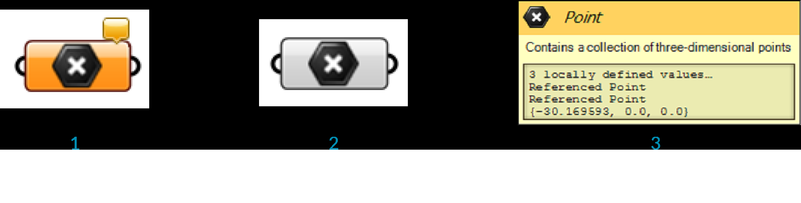

### 1.2.3. DATA TYPES

#####Most parameters can store two different kinds of data: Volatile and Persistent. Volatile data inherits from one or more sources. Grasshopper reworks all volatile data whenever a new solution starts. Persistent data is data which has been specifically set by the user.

Let's review how a Point Parameter behaves.

When you drag-and-drop a Point Parameter from the Params/Geometry Panel onto the canvas, the Parameter is orange. The orange color indicates it is generating a warning. There is no need to worry because this behavior is normal. The warning is just meant to inform you the parameter is empty. In other words, it does not yet contain any persistent records and it has so far failed to collect volatile data. It cannot yet provide data to the rest of the Grasshopper definition.  In a typical definition, a lack of data from a parameter may prevent the rest of the definition from carrying out its actions. Thus rectifying such problems is a normal and necessary step. 

####1.2.3.1. PERSISTENT DATA
Access and manage persistent data through a parameter's context menu¹. 
Each parameter type shows a different manager. For example, a Point parameter allows you to set persistent point data through its context menu. It offers two modes for setting the persistent data. Choose either “Set one Point” or “Set Multiple Points”. After clicking either of these, the Rhino window will receive the focus (*).   A prompt will ask for the location of a Point.  One way to indicate point locations is by clicking in the Rhino view-ports. Another more precise option is to enter point co-ordinates via the Rhino command-line. If the command was “Set Multiple Points”, continue to enter additional points.  End the process with a right-click or a blank command-line entry.

>¹A context menu is the menu which appears after right-clicking on a particular thing, or on one of its particular parts.  It may show different things depending on what the target of the click was.  The target is the context for the right-click.

>²When a window receives the focus  this means it will receive mouse and keyboard input until the focus shifts to another window.  It may also appear in front of other windows, hiding them if they are sharing screen space.

Once you have defined all the points you can press Enter and they will become part of the Parameters persistent data record. This means the Parameter is now no longer empty and it turns from orange to gray. (Notice that the information balloon in the upper right corner also disappears as there are no more warnings). At this point you can use the points stored in this Parameter for any subsequent input in your definition.

>1. The parameter is orange, indicating it contains no persistent records (and it failed to collect volatile data) and thus has no effect on the outcome of the solution. Right click on any parameter to set its persistent data.
2. Once the parameter contains some persistent data, the component will turn from orange to gray.
3. The tool-tip for the point parameter shows the stored persistent data. In this image, it shows a collection of referenced points.

####1.2.3.2. VOLATILE DATA
Volatile data, as the name suggests, is not permanent and will be destroyed each time the solution is expired. However, this will often trigger an event to rebuild the solution and update the scene. Generally speaking, most of the data generated ‘on the fly’ is considered volatile.

As previously stated, Grasshopper data is stored in Parameters (either in Volatile or Persistent form) and is used in various Components. When data is not stored in the permanent record set of a Parameter, it must be inherited from elsewhere. Every Parameter (except output parameters) defines where it gets its data from and most Parameters are not very particular. You can plug a number Parameter (which just means that it is a decimal number) into an integer source and it will take care of the conversion.

You can change the way data is inherited and stored in the context menu of a parameter or component input. To change store referenced Rhino geometry in the grasshopper definition itself, right click a parameter and select Internalise data from the menu. This is useful if you want your grasshopper definition to be independent from a Rhino file.

You can also Internalise data in a component input. Once you select Internalise data in the menu, any wires will disconnect from that input. The data has been changed from volatile to persistent, and will no longer update.

If you want the data to become volatile again, simply reconnect the wires to the input and the values will automatically be replaced. You can also right click the input and select Extract parameter. Grasshopper will create a parameter connected to the input with a wire that contains the data.

####1.2.3.3. INPUT PARAMETERS
Grasshopper has a variety of Parameters that offer you the ability to interface with the data that is begin supplied to Component inputs and thereby control for changing the result of your definition. Because they Parameters that change with our input, they generate Volatile Data.

**Number Slider**
The number slider is the most important and widely used Input Parameter. It allows us to output a value between two given extremes by interacting with its grip with our mouse. Sliders can be used to specify a value and see the change to our deifnition that comes with adjusting the grip, but a slider should also be thought of as the means to identify successful ranges of our definition.

>1. Drag the slider grip to change the value - each time you do this, Grasshopper will recompute the solution.
2. Right click the slider component to change the name, type, and values.
3. Editable text field for the slider name.
4. Select the type of number for the slider to use.
5. Edite the range of values.
6. Double click the name portion of the slider component to open the Slider Editor.

**Graph mapper**
The Graph Mapper is a two-dimensional interface with which we can modify numerical values. It lets us directly modify the relationship between its input and its output. It will output the Y-Value on the graph where it crosses the x-coordinate having the value at its input. It is useful for modulating a set of values within an intuitive, grip-based interface.

>1. Move the grips to edit the graph - each time you do this, Grasshopper will recompute the solution.
2. Right click the graph mapper component to select the graph type.

>1. Double click the graph mapper to open the Graph Editor.
2. Change the x and y domains.

**Value List**
The Value List stores a collection of values with corresponding list of Labels associated by way of an equal sign. It is particularly useful when you want to have a few options, labeled with meaning, that can supply specific output values.

>1. Right click the Value List component and select an option from the menu.
2. Double click the Value List component to open the editor and add or change values.
3. In Drop-down List mode, click the arrow to select one of the values. The solution will recompute each time you change the value.
4. In Check List mode, click next to each value to check it. The component will output all the values that are checked.
5. In Value Sequence and Value Cycle modes, click the left and right facing arrows to cycle through the values.
